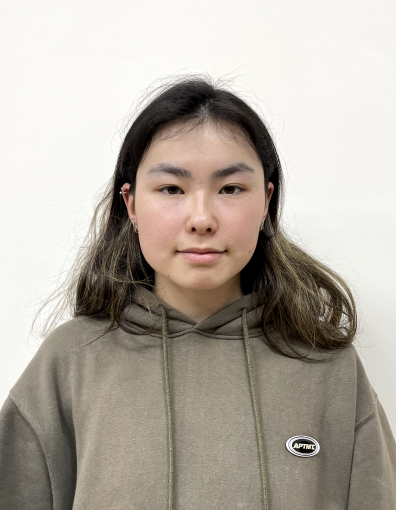

### Adinai Turatbekova

---

#### Contacts:

- **Tel**: +77075655743
- **Email**: sunny.adinay@mail.ru
- **Github**: https://github.com/anemoon-ik
- **Discord**: anemoon-ik

#### About myself:

> My vision of the ideal working environment is to to be around people who make you you're comfortable with and you can allow yourself to make a mistake, knowing that you won't be judged. A place where harmony, new ideas and the desire to develop reigns.

#### Education:

Almaty Management University (2019-2023)

- Bachelor's degree on "Software Engineering"
  - GPA 3,55/4.0

Ziyash Bektenov Girls High School (2014-2019)

- Secondary Education
  - GPA 4,9/5
  - Russian Language Olympiad (2019)
  - Medalist of debate "World Scholar's Cup"

#### Code example:

```
{route.params.exercises.map((item, index) => (
          <Pressable
            style={{ margin: 10, flexDirection: "row", alignItems: "center" }}
            key={index}
          >
            <Image
              style={{ width: 90, height: 90 }}
              source={{ uri: item.image }}
            />
            <View style={{ marginLeft: 10 }}>
              <Text style={{ fontSize: 17, fontWeight: "bold" }}>
                {item.name}
              </Text>

              <Text style={{ marginTop: 4, fontSize: 17, color: "black" }}>
                x{item.sets}
              </Text>
            </View>
          </Pressable>
        ))}

```

#### Work experience:

- IT Assistant (June 2021 - September 2021):

  - Helped in solving technical problems and observed the process.
  - Helped with the organization of VIP catering from the technical part

- Hackathon participation (2019-2021):

  - Google Hach Code Competition (2019)
  - Hackathon in KBTU (2019)
  - Ioka Fintech hackathon (2021)

#### Skills

- Programming skills

  - Python
  - SQL
  - HTML & CSS Basics
  - Data Analysis

- Languages
  - English (C1)
  - Turkish (A2)
  - Kazakh (A1)
  - Russian (native)
  - Kyrgyz (native)
